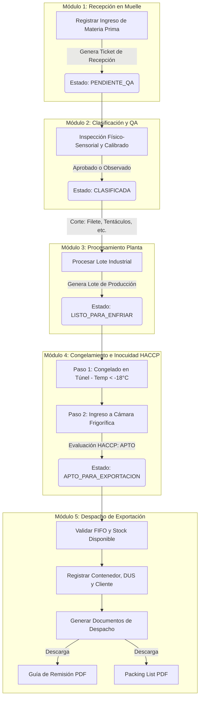
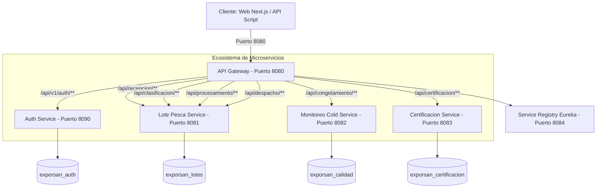

# 📘 Informe de Arquitectura y Manual del Sistema ExporTrace Ica

Este informe documenta exhaustivamente el sistema **ExporTrace Ica**, una plataforma web e industrial distribuida diseñada para automatizar, controlar y auditar la trazabilidad de la pota y el perico en las plantas pesqueras, garantizando el cumplimiento de las normativas de inocuidad alimentaria (HACCP) y agilizando la emisión de documentos de exportación.

---

## 1. Introducción y Propósito del Sistema

El principal objetivo de **ExporTrace Ica** es resolver el problema de la pérdida de información en la cadena de frío y el procesamiento de productos hidrobiológicos (especialmente pota y perico). Al automatizar el registro de cada etapa y forzar reglas de negocio estrictas de transición de estado, el sistema asegura:
* **Trazabilidad de Extremo a Extremo (E2E):** Seguimiento preciso desde que la embarcación descarga en el muelle hasta el contenedor frigorífico en tránsito marítimo.
* **Control de Inocuidad (HACCP):** Asegurar y certificar que cada lote haya pasado por los controles críticos de temperatura en los túneles de congelación y cámaras frigoríficas.
* **Agilidad Logística:** Generación automatizada y descarga en formato PDF del **Packing List** y la **Guía de Remisión de Remitente** para aduanas e inspecciones.

---

## 2. Arquitectura de Negocio (El Flujo de 5 Módulos)

El software modela la cadena de producción pesquera en cinco módulos secuenciales. Cada paso es prerrequisito del siguiente, impidiendo saltos de etapa y registros duplicados:



### Reglas Críticas de Transición y Negocio:
1. **Módulo 1 (Recepción):** El operario de muelle registra la embarcación, el número de Declaración de Extracción (DER), el peso bruto en báscula y la temperatura de llegada. El ticket queda en `PENDIENTE_QA`.
2. **Módulo 2 (Clasificación/Calidad):** El inspector de QA evalúa las propiedades organolépticas (olor, color, textura) y el calibre. El peso útil se calcula descontando la merma y el ticket de recepción pasa a `CLASIFICADA`.
3. **Módulo 3 (Procesamiento):** Se transforma la materia prima clasificada en cortes comerciales (Filete, Tubo, Aletas, Tentáculos, Rejos) envasados en empaques específicos (ej. caja máster 10kg). Genera un **ID de Lote de Producción único** (ej. `LOTE-POTA-009`) en estado `LISTO_PARA_ENFRIAR`.
4. **Módulo 4 (Congelamiento HACCP):** 
   - **Túnel:** Se registra el túnel usado (ej. T-01) y la temperatura en el centro térmico (obligatorio menor a -18°C).
   - **Cámara:** Se registra la cámara de destino (ej. Cámara A) y se evalúa el estado HACCP como `APTO` o `RECHAZADO`. Si es apto, la fecha de vencimiento se calcula automáticamente a **18 meses** del ingreso, y el lote pasa a estar `APTO_PARA_EXPORTACION`.
5. **Módulo 5 (Despacho):** El despachador consulta el stock de lotes aptos y realiza el embarque, ingresando los precintos de seguridad navieros, el número de contenedor, la reserva naviera (Booking) y el certificado SANIPES. El estado del lote pasa a `DESPACHADO_EN_TRANSITO`.

---

## 3. Arquitectura Tecnológica (Microservicios)

El sistema está construido bajo una **arquitectura orientada a servicios (SOA)** con Spring Boot en el backend y Next.js en el frontend. Los servicios se comunican a través de un API Gateway y se descubren dinámicamente mediante Eureka.



### Detalle de Componentes Técnicos:

1. **API Gateway (`api-gateway` | Puerto 8080):** 
   - Punto de entrada unificado para todas las solicitudes.
   - Enruta el tráfico dinámicamente a los servicios registrados en Eureka.
   - Contiene un filtro de **Rate Limiting** que restringe el uso a un máximo de **10 solicitudes por segundo** por IP para prevenir ataques de denegación de servicio (HTTP 429).
   - Administra los permisos globales y el CORS.
2. **Eureka Discovery Server (`service-registry` | Puerto 8084):**
   - Directorio vivo donde todos los microservicios se registran al iniciar, lo que permite escalabilidad horizontal y balanceo de carga sin IPs estáticas.
3. **Auth Service (`auth-service` | Puerto 8090):**
   - Emite tokens seguros JWT (JSON Web Tokens).
   - Almacena la base de datos de credenciales y roles.
   - Valida firmas digitales de tokens para cada microservicio.
4. **Lote de Pesca y Trazabilidad (`lote-pesca-service` | Puerto 8081):**
   - Es el núcleo transaccional del negocio. 
   - Controla las fases de Recepción, Clasificación, Procesamiento y Despacho.
   - Implementa el motor de generación en PDF de la documentación (Packing List y Guía de Remisión).
5. **Monitoreo Cold Service (`monitoreo-cold-service` | Puerto 8082):**
   - Registra y audita las temperaturas en los túneles y el ingreso a cámaras.
   - Encargado de la validación del protocolo de inocuidad HACCP.
6. **Certificacion Service (`certificacion-service` | Puerto 8083):**
   - Maneja la validación de certificados de calidad y sanitarios (SANIPES).

---

## 4. Diseño de la Base de Datos (Esquema MySQL)

El sistema utiliza bases de datos distribuidas independientes por servicio para cumplir con los principios de acoplamiento débil (Loose Coupling):

* **`exporsan_auth`**: Tablas de usuarios y roles (`users`, `roles`).
* **`exporsan_lotes`**: Tablas de negocio:
  - `ticket_recepcion`: ID, especie, número de DER, peso bruto, temperatura, estado.
  - `clasificacion`: Parámetros físicos, rendimiento industrial, porcentaje de descarte.
  - `procesamiento`: Detalles de corte, empaques, cantidad de bultos y el lote generado.
  - `despacho`: Registros de aduana (DUS), naviera, contenedor, RUC y nombre del cliente.
* **`exporsan_calidad`**:
  - `congelamiento_tunel`: Registro de temperaturas bajo cero.
  - `congelamiento_camara`: Asignación de cámaras, estado de inocuidad alimentaria HACCP y vencimiento.

---

## 5. Control de Acceso y Roles (Seguridad)

Cada endpoint del sistema está protegido con `@PreAuthorize` según el rol del usuario:

| Usuario | Contraseña | Rol (Spring Security) | Módulos Permitidos |
|---|---|---|---|
| `recepcion` | `recepcion123` | `ROLE_RECEPCION` | Módulo 1 (Recepción en Muelle) |
| `calidad` | `calidad123` | `ROLE_CALIDAD` | Módulo 2 y 4 (QA, HACCP y Cámaras) |
| `produccion` | `produccion123` | `ROLE_PRODUCCION` | Módulo 3 y 4 (Corte, Túneles de Congelación) |
| `logistica` | `logistica123` | `ROLE_LOGISTICA` | Módulo 5 (Despacho, descarga de Packing List y Guías) |
| `admin` | `admin123` | `ROLE_ADMIN` | Acceso irrestricto a todos los módulos |

---

## 6. Manual de Operación y Scripts de Arranque/Parada

Para facilitar el control del sistema de manera unificada en Windows, se proporcionan tres scripts ejecutables (`.bat`) en la raíz del proyecto:

### 1. Iniciar todo el Sistema (`start.bat`)
* **Qué hace automáticamente:**
  1. Libera los puertos de ejecuciones anteriores si están ocupados (`3000`, `8080-8084`, `8090`).
  2. Verifica que Java 17 y Node.js estén en el PATH.
  3. Verifica que MySQL esté corriendo e intenta levantarlo si está apagado.
  4. Crea las bases de datos de MySQL si no existen en tu servidor local.
  5. Verifica la compilación Maven del backend (compila los `.jar` si hacen falta).
  6. Levanta los 6 microservicios en segundo plano, guardando sus salidas en la carpeta `./logs`.
  7. Levanta el Frontend de Next.js en segundo plano (guardando log en `./logs/frontend-dev.log`).
* **Cómo usar:** Haz doble clic en `start.bat` y espera a que termine de levantar (aprox. 30-40 segundos).

### 2. Detener todo el Sistema (`stop.bat`)
* **Qué hace automáticamente:**
  1. Busca y finaliza de manera forzada (`taskkill /F`) todos los procesos de Spring Boot (Java) activos.
  2. Detiene cualquier proceso de Node.js escuchando en el puerto 3000.
  3. Limpia archivos temporales y la carpeta `.pids`.
* **Cómo usar:** Haz doble clic en `stop.bat` y presiona cualquier tecla al finalizar para cerrar la consola.

---

## 7. Verificación del Sistema (E2E Integration Test)

En caso de requerir una auditoría de integración automática de todos los endpoints y la base de datos sin usar la interfaz gráfica, se ha programado un script en PowerShell disponible en:
📁 [test_e2e.ps1](file:///C:/Users/Anderson/.gemini/antigravity/brain/dda3b4fa-298d-43fb-990a-54a0f627984c/scratch/test_e2e.ps1)

### Ejecución en Consola PowerShell:
```powershell
powershell -ExecutionPolicy Bypass -File C:\Users\Anderson\.gemini\antigravity\brain\dda3b4fa-298d-43fb-990a-54a0f627984c\scratch\test_e2e.ps1
```
*Este script simula transacciones reales paso a paso, verifica el limitador de solicitudes del Gateway y descarga los documentos PDF, arrojando código de salida `0` si todo está operando perfectamente.*

---

## 8. APIs y Documentación Interactiva (Swagger)

Puedes acceder e interactuar con cada microservicio o a través del Gateway mediante la documentación Swagger incorporada:
* **Swagger API Gateway (Agregado):** `http://localhost:8080/swagger-ui.html`
* **Swagger Módulo de Lotes:** `http://localhost:8081/swagger-ui.html`
* **Swagger Auth:** `http://localhost:8090/swagger-ui.html`
