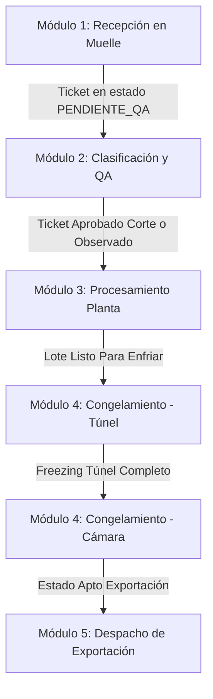

# Manual del Módulo de Trazabilidad Pesquera (Pota / Perico)
Este manual detalla el funcionamiento, roles, flujo secuencial de datos, payloads de ejemplo y la guía paso a paso para la verificación end-to-end del sistema de trazabilidad implementado en el backend del proyecto **ExporTrace Ica**.

---

## 1. Descripción del Flujo Secuencial de los 5 Módulos

El sistema realiza una trazabilidad completa lote por lote desde el arribo de la materia prima en muelle hasta el despacho de exportación:



### Reglas de Negocio y Transiciones de Estado
1. **Clasificación**: Solo se puede registrar sobre una `Recepción` en estado `PENDIENTE_QA`. Una vez registrada la clasificación, la recepción pasa al estado `CLASIFICADA` para impedir dobles registros.
2. **Procesamiento**: Solo se permite sobre una `Clasificación` en estado `APROBADO_CORTE` u `OBSERVADO`. Cambia a `PROCESADO`.
3. **Congelamiento (Túnel)**: Solo se permite sobre un `Procesamiento` en estado `LISTO_PARA_ENFRIAR`.
4. **Congelamiento (Cámara)**: Solo se puede completar si ya se registró el paso de Túnel para el lote. Al completarse en Cámara (con estado HACCP `APTO`), el lote pasa a estar en estado `APTO_PARA_EXPORTACION`.
5. **Despacho**: Solo se puede crear sobre un lote de `Congelamiento` en estado `APTO_PARA_EXPORTACION`. Al transitar, disminuye el stock disponible.

---

## 2. Roles y Credenciales de Prueba

El sistema implementa seguridad basada en roles (`@PreAuthorize`) delegada por el API Gateway (`api-gateway` en el puerto `8080`).

| Usuario | Contraseña | Rol (Spring Security) | Módulo Principal de Trabajo |
|---|---|---|---|
| `admin` | `admin123` | `ROLE_ADMIN` | Control Total / Configuración |
| `recepcion` | `recepcion123` | `ROLE_RECEPCION` | Módulo 1: Recepción de Materia Prima |
| `calidad` | `calidad123` | `ROLE_CALIDAD` | Módulo 2 y 4: Clasificación / Aprobación HACCP |
| `produccion` | `produccion123` | `ROLE_PRODUCCION` | Módulo 3 y 4: Procesamiento / Túnel de Congelado |
| `logistica` | `logistica123` | `ROLE_LOGISTICA` | Módulo 5: Despacho, Guías de Remisión y Packing List |

---

## 3. Guía Paso a Paso con Payloads de Ejemplo (JSON)

Todas las peticiones deben enviarse a través del API Gateway (`http://localhost:8080`).

### Paso 1: Autenticación (Login)
* **Endpoint**: `POST /api/v1/auth/login`
* **Payload**:
```json
{
  "username": "recepcion",
  "password": "recepcion123"
}
```
* **Respuesta**:
```json
{
  "token": "Bearer eyJhbGciOiJIUzI1NiIsIn...",
  "username": "recepcion"
}
```

### Paso 2: Registrar Recepción (Muelle)
* **Rol requerido**: `ROLE_RECEPCION` o `ROLE_ADMIN`
* **Endpoint**: `POST /api/recepcion`
* **Payload**:
```json
{
  "numeroDER": "DER-2026-TEST",
  "nombreEmbarcacion": "Don Aurelio",
  "matriculaEmbarcacion": "DAU-2201",
  "especie": "POTA",
  "pesoBrutoBascula": 1200.00,
  "temperaturaLlegada": 4.5,
  "guiaRemisionRemitente": "GR-9005",
  "turno": "MAÑANA"
}
```
* **Respuesta**:
```json
{
  "idTicket": 4,
  "numeroDER": "DER-2026-TEST",
  "estado": "PENDIENTE_QA",
  "fechaHoraIngreso": "2026-07-13T00:05:45"
}
```

### Paso 3: Registrar Clasificación (QA)
* **Rol requerido**: `ROLE_CALIDAD` o `ROLE_ADMIN`
* **Endpoint**: `POST /api/clasificacion`
* **Payload**:
```json
{
  "loteOrigenId": 4,
  "evaluacionSensorial": "FIRME",
  "calibreTalla": "M",
  "kilosMermaDescarte": 50.00,
  "firmaQA": "ING. C. SALAZAR",
  "estado": "APROBADO_CORTE"
}
```

### Paso 4: Registrar Procesamiento (Corte y Empaque)
* **Rol requerido**: `ROLE_PRODUCCION` o `ROLE_ADMIN`
* **Endpoint**: `POST /api/procesamiento`
* **Payload**:
```json
{
  "loteOrigenId": 2,
  "tipoCorte": "FILETE",
  "tratamientoQuimico": "NATURAL",
  "tipoEmpaque": "CAJA_MASTER_10KG",
  "cantidadBultosCajas": 115,
  "pesoNetoFinal": 1150.00,
  "lineaProceso": "Línea 01 - Corte"
}
```
* **Respuesta**:
```json
{
  "id": 2,
  "idLoteProduccion": "LOTE-POTA-002",
  "estado": "LISTO_PARA_ENFRIAR"
}
```

### Paso 5: Congelamiento en Túnel
* **Rol requerido**: `ROLE_PRODUCCION` o `ROLE_ADMIN`
* **Endpoint**: `POST /api/congelamiento/tunel`
* **Payload**:
```json
{
  "loteOrigenId": 2,
  "numeroTunel": "T-02",
  "fechaHoraIngresoTunel": "2026-07-13T10:00:00",
  "fechaHoraSalidaTunel": "2026-07-13T14:00:00",
  "temperaturaCentroTermico": -18.5
}
```

### Paso 6: Ingreso a Cámara y Control HACCP
* **Rol requerido**: `ROLE_CALIDAD` o `ROLE_ADMIN`
* **Endpoint**: `POST /api/congelamiento/camara`
* **Payload**:
```json
{
  "loteOrigenId": 2,
  "camaraDestino": "Cámara B",
  "fechaHoraIngresoCamara": "2026-07-13T15:00:00",
  "fechaProgramadaDespacho": "2026-07-23",
  "estadoInocuidadHACCP": "APTO"
}
```

### Paso 7: Consultar Lotes Disponibles para Despacho
* **Rol requerido**: Autenticado
* **Endpoint**: `GET /api/despacho/disponibles`
* **Respuesta**: Lista de lotes congelados en estado `APTO_PARA_EXPORTACION`.

### Paso 8: Registrar Despacho
* **Rol requerido**: `ROLE_LOGISTICA` o `ROLE_ADMIN`
* **Endpoint**: `POST /api/despacho`
* **Payload**:
```json
{
  "loteId": 2,
  "rucCliente": "20567891234",
  "puertoDestino": "Puerto de Manzanillo",
  "reservaNaviera": "BKG-99002",
  "numeroContenedorFrigorifico": "MSKU-998822-1",
  "precintosAduanerosNavieros": "AD-1122",
  "temperaturaSeteoContenedor": -20.0,
  "numeroDUS": "DUS-9900",
  "codigoCertificadoSanitario": "SANIPES-002",
  "estado": "DESPACHADO_EN_TRANSITO"
}
```
* **Nota**: La **Razón Social del Cliente** se autocompleta consultando el `RucService` externo.

### Paso 9: Descargar Documentos PDF
* **Packing List**: `GET /api/despacho/{despachoId}/pdf/packing-list`
* **Guía de Remisión**: `GET /api/despacho/{despachoId}/pdf/guia-remision`

---

## 4. Swagger y OpenAPI

El sistema expone la documentación interactiva en los siguientes endpoints locales:

- **API Gateway (Swagger Agregador)**: `http://localhost:8080/swagger-ui.html`
- **Servicio de Lote de Pesca y Trazabilidad**: `http://localhost:8081/swagger-ui.html`

---

## 5. Solución de Problemas Comunes (Troubleshooting)

1. **Error: `Column 'fecha_hora_ingreso' cannot be null` al arrancar**:
   - Este error se produce si no se inicializa la fecha y hora en el sembrado de datos en `DataInitializer.java`. Se ha corregido para establecer `LocalDateTime.now()` por defecto.
2. **Error HTTP 429 (Too Many Requests)**:
   - El `RateLimitFilter` del `api-gateway` limita las peticiones por dirección IP a un máximo de **10 peticiones por segundo**. Si ejecutas scripts automáticos de integración, introduce una demora de al menos **150 ms** entre peticiones.
3. **Error HTTP 409 (Conflict)**:
   - Se produce si intentas registrar un lote saltándote un paso del flujo de trazabilidad, o si intentas clasificar/despachar un lote que ya ha sido procesado/despachado.
