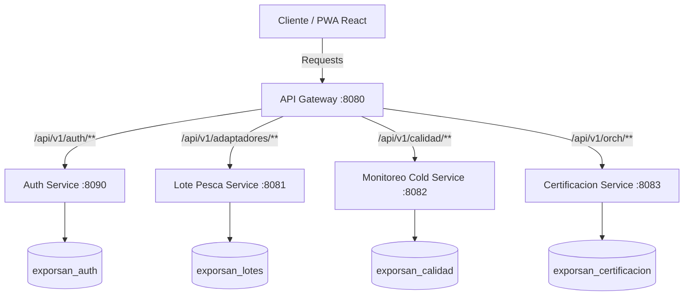

# ExporTrace Ica — Sistema de Trazabilidad Pesquera (SOA)

ExporTrace Ica es una plataforma empresarial orientada a servicios (SOA) diseñada para automatizar la trazabilidad y la certificación de la cadena de frío para productos pesqueros congelados de consumo humano directo (principalmente Pota y Perico) en Pisco, Perú. 

Este software optimiza las operaciones de **Exportadora San Andrés (ExporSan)** conectando la recepción de pesca en puerto, el control de temperatura de almacenamiento e inspección sanitaria (SANIPES) en una plataforma PWA de alto rendimiento.

---

## 🏗️ Arquitectura Orientada a Servicios (SOA)

El sistema está diseñado bajo una arquitectura de microservicios autónomos, comunicados mediante REST APIs y unificados a través de un Gateway central. Cada microservicio gestiona su propio almacén de datos físico (Base de datos MySQL independiente), lo que garantiza el desacoplamiento.



### Componentes del Sistema

1. **API Gateway (Puerto 8080)**: Punto único de entrada. Enruta las peticiones basándose en la URL y valida los tokens JWT en las cabeceras. Agrega metadatos (`X-User-Id` y `X-User-Rol`) a la request antes de transferirla a los microservicios internos.
2. **Auth Service (Puerto 8090)**: Centraliza la autenticación, generación de tokens y roles.
3. **Lote Pesca Service (Puerto 8081)**: Administra la información de embarcaciones, descargas de materia prima y creación de lotes.
4. **Monitoreo Cold Service (Puerto 8082)**: Registra mediciones de temperatura en cámaras y túneles. Analiza si las mediciones violan los límites permitidos de las especies para cambiar el estado de cadena de frío (`OK`, `ALERTA`, `RUPTURA`).
5. **Certificación Service (Puerto 8083)**: Servicio orquestador. Permite validar los requisitos del lote y cadena de frío para emitir expedientes y códigos QR oficiales ante SANIPES.

---

## 🛠️ Requisitos Previos

Antes de clonar e iniciar el sistema, asegúrese de tener instalado:

- **Java JDK 17** o superior.
- **Node.js v18** o superior.
- **MySQL Server** (ejecutándose en el puerto `3306` con usuario `root` y contraseña `root`).
- **Maven** (opcional, incluido wrapper).
- **Git**.

---

## 🚀 Guía de Inicio Rápido (start.bat)

El proyecto incluye un script de automatización (`start.bat`) que realiza todo el proceso de aprovisionamiento, compilación, enlace de base de datos e inicio en un solo comando:

1. **Clonar el repositorio**:
   ```bash
   git clone <URL_REPOSITORIO>
   cd ksyan
   ```
2. **Asegurar que MySQL esté iniciado**:
   El puerto `3306` debe estar activo. El script intentará crearte las cuatro bases de datos necesarias automáticamente:
   - `exporsan_auth`
   - `exporsan_lotes`
   - `exporsan_calidad`
   - `exporsan_certificacion`

3. **Ejecutar el script de inicio**:
   Haga doble clic en `start.bat` o ejecútelo en su consola:
   ```cmd
   start.bat
   ```
   El script realizará las siguientes tareas de forma automática:
   * **Libera los puertos** necesarios (`8080`, `8081`, `8082`, `8083`, `8090`, `3000`) si quedaron tomados por ejecuciones anteriores.
   * **Crea las carpetas** de logs (`/logs`) y pids (`/.pids`).
   * **Compila el Backend** con Maven en un empaquetado JAR (si detecta que no existen compilaciones previas).
   * **Inicializa las bases de datos** en MySQL.
   * **Instala las dependencias** de React del frontend (`npm install`) si no se detecta la carpeta `node_modules`.
   * **Levanta los 5 microservicios** en segundo plano.
   * **Levanta el servidor Next.js** del frontend.

4. **Detener el sistema**:
   Para apagar todos los procesos de forma limpia, ejecute:
   ```cmd
   stop.bat
   ```

---

## 🛡️ Credenciales de Prueba

Puede iniciar sesión en `http://localhost:3000` con cualquiera de las siguientes cuentas pre-cargadas en el sistema:

| Nombre de Usuario | Contraseña | Rol | Módulos Permitidos |
| :--- | :--- | :--- | :--- |
| **admin** | `admin123` | **ADMIN** | Todos los módulos, gestión de especies y usuarios. |
| **calidad** | `calidad123` | **QA** | Dashboard, Registrar Temperatura y Certificación. |
| **logistica** | `logistica123` | **LOGISTICA** | Dashboard, Gestión de Lotes y Certificación. |

---

## 📱 Soporte PWA (Instalable en Móviles y Desktop)

ExporTrace Ica cumple con el estándar **Progressive Web App (PWA)**:
* **Escáner QR Integrado**: Diseñado especialmente para el Inspector de Calidad en planta. Utiliza la cámara en vivo del celular o PC (solicitando permisos al navegador) para enfocar y decodificar instantáneamente el código del lote, previniendo errores de digitación manual.
* **Instalable**: Al navegar al sitio, verá el botón de "Instalar Aplicación" en la barra de búsqueda del navegador (en desktop) o el banner "Agregar a la pantalla principal" (en móviles Chrome/Safari), permitiendo utilizar el software de manera offline o nativa.
